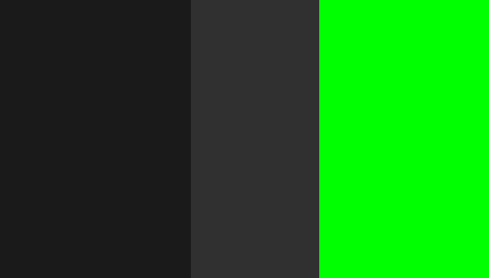

# HerrDextro.github.io

In progess.
## Zusammenfassung 06.06.2025
Heute habe ich meine persönliche GitHUb Seite erstellt und ein basic-Mockup gemacht, wie es aussehen sollte. Ich habe zuerst das Mockup in Draw.io erstellt und dann nachgemacht mit HTML/CSS, danach habe ich die Gebiete gefärbt, damit es klar ist was wo kommt.
Hier noch ein Bild von mein Mockup:

# Arbeitspakete für 13.06.2025:
- [ ] Farbschema wählen
- [ ] Farben im CSS machen
- [ ] Subpages für die Projekte
- [ ] Bilder implementieren.

Farbschema: base black, base gray, green.
Hex codes: #1A1A1A, #303030, #00FF00

